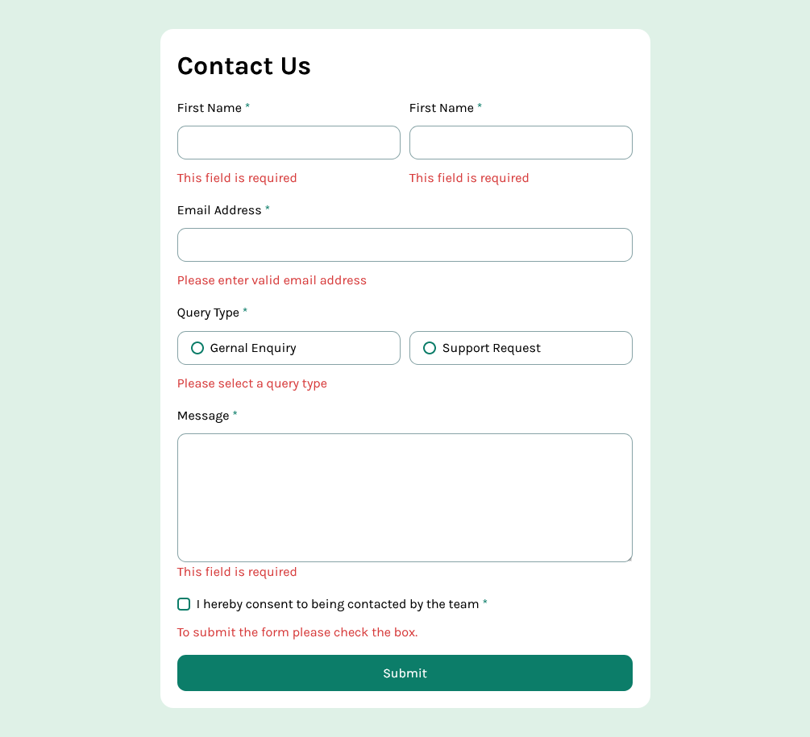

# Frontend Mentor - Contact form solution

This is a solution to the [Contact form challenge on Frontend Mentor](https://www.frontendmentor.io/challenges/contact-form--G-hYlqKJj). Frontend Mentor challenges help you improve your coding skills by building realistic projects. 


## Overview

### The challenge

Users should be able to:

- Complete the form and see a success toast message upon successful submission
- Receive form validation messages if:
  - A required field has been missed
  - The email address is not formatted correctly
- Complete the form only using their keyboard
- Have inputs, error messages, and the success message announced on their screen reader
- View the optimal layout for the interface depending on their device's screen size
- See hover and focus states for all interactive elements on the page

### Screenshot




### Links

- Solution URL: [Github Repository](https://github.com/qayoommunawar/Contact-Us-Form-Interactive)
- Live Site URL: [Github live page](https://qayoommunawar.github.io/Contact-Us-Form-Interactive/)

## My process

### Built with

- Semantic HTML5 markup
- CSS custom properties
- Flexbox
- CSS Grid
- Mobile-first workflow


### What I learned

Created customize radio buttons, and checkbox. the ideas is totally new to me. it was very frustrating but at the end
i succeeded.

Here is the CSS for radio inputs.
```css
input[type='radio']{
    display: none;
}


.radio-item{
    padding: calc(var(--gap-sml)/4) calc(var(--gap-sml)/2);
    border: 1px solid var(--color-grey-500);
    border-radius: calc(var(--gap-sml)/3);  
    cursor: pointer;
    display: flex;
    gap: calc(var(--gap-sml)/4);
    align-items: center;
}

.radio-mark {
    width: 16px;
    height: 16px;
    border: 2px solid var(--color-green-600); 
    border-radius: 50%;
    display: inline-block;
    position: relative;
    background-color: white; 
    transition: all 0.3s ease;

}

.radio-item input[type="radio"]:checked + .radio-mark::after {
    content: "";
    position: absolute;
    top: 2px;
    left: 2px;
    width: 8px;
    height: 8px;
    border-radius: 50%;
    background-color: var(--color-green-600); 

}

.radio-item:has(input[type="radio"]:checked) {
    background-color: var(--color-green-200);
  }
```

### Continued development

I am not too much familiar with form styling, so responsivness and interactivity through js surely needs a lot
of work to make the styling more optimized.


